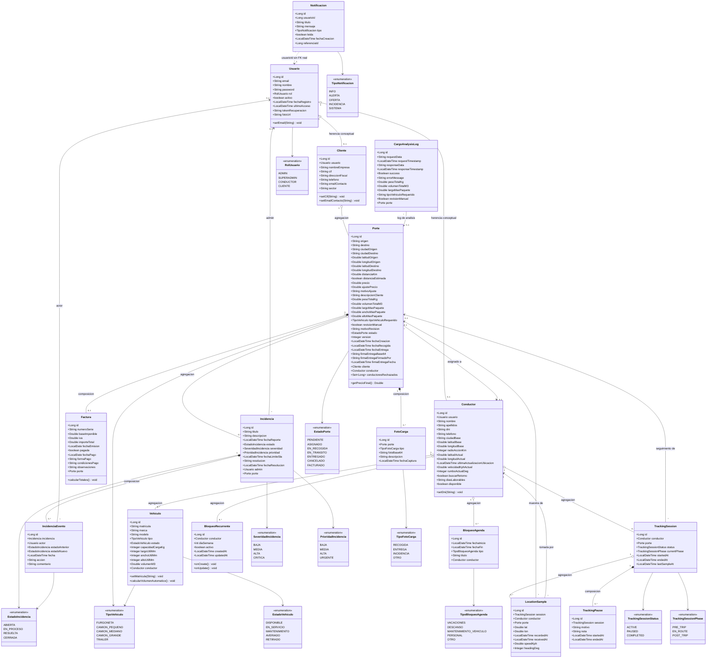

# Diagrama de clases ampliado - CargoHub backend

## Leyenda

| Simbolo | Significado |
|---|---|
| `<|--` | Herencia / generalizacion conceptual |
| `o--` | Agregacion |
| `*--` | Composicion |
| `-->` | Asociacion simple |
| `..>` | Asociacion debil / sin FK real |

## Nota metodologica

`Cliente` y `Conductor` se representan como especializaciones conceptuales de `Usuario` porque en el dominio son perfiles de usuario. En el codigo JPA no usan `extends`, sino una relacion `@OneToOne(cascade = ALL)` hacia `Usuario`.
