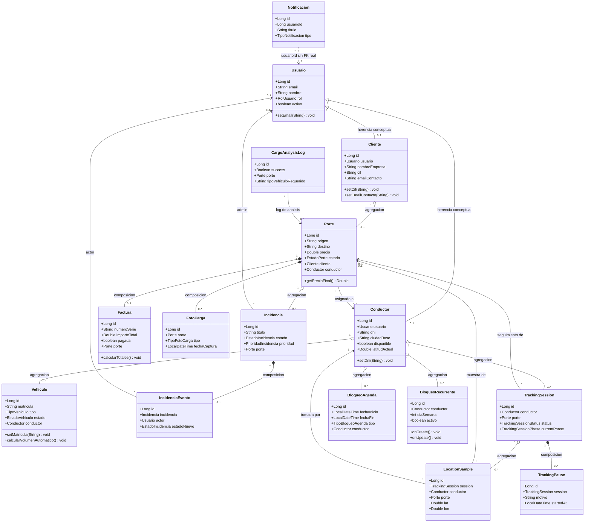

# Diagrama de clases reducido - CargoHub backend

## Leyenda

| Simbolo | Significado |
|---|---|
| `<|--` | Herencia / generalizacion conceptual |
| `o--` | Agregacion |
| `*--` | Composicion |
| `-->` | Asociacion simple |
| `..>` | Asociacion debil / sin FK real |
