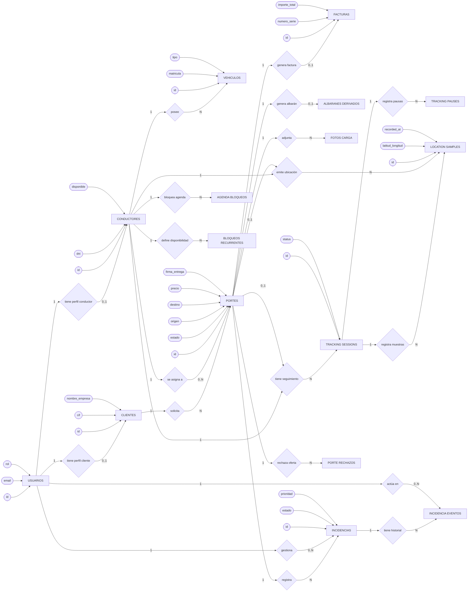
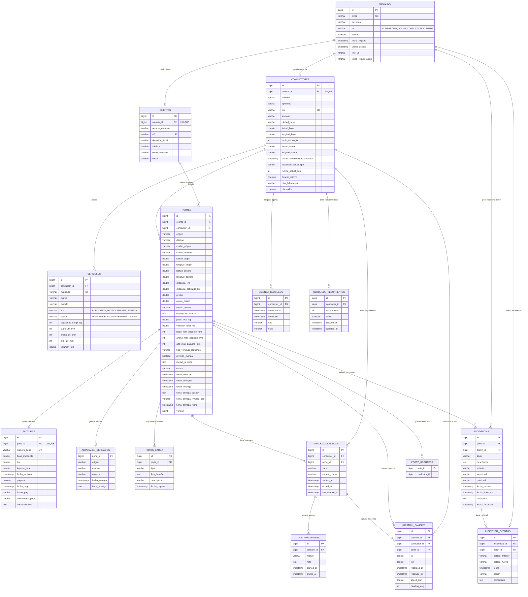
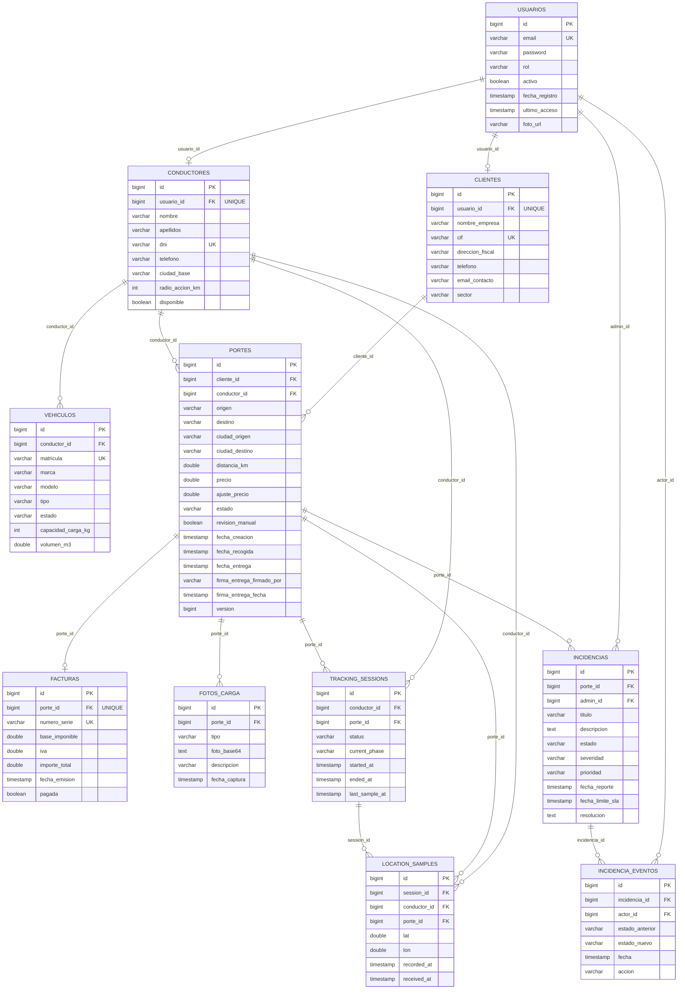
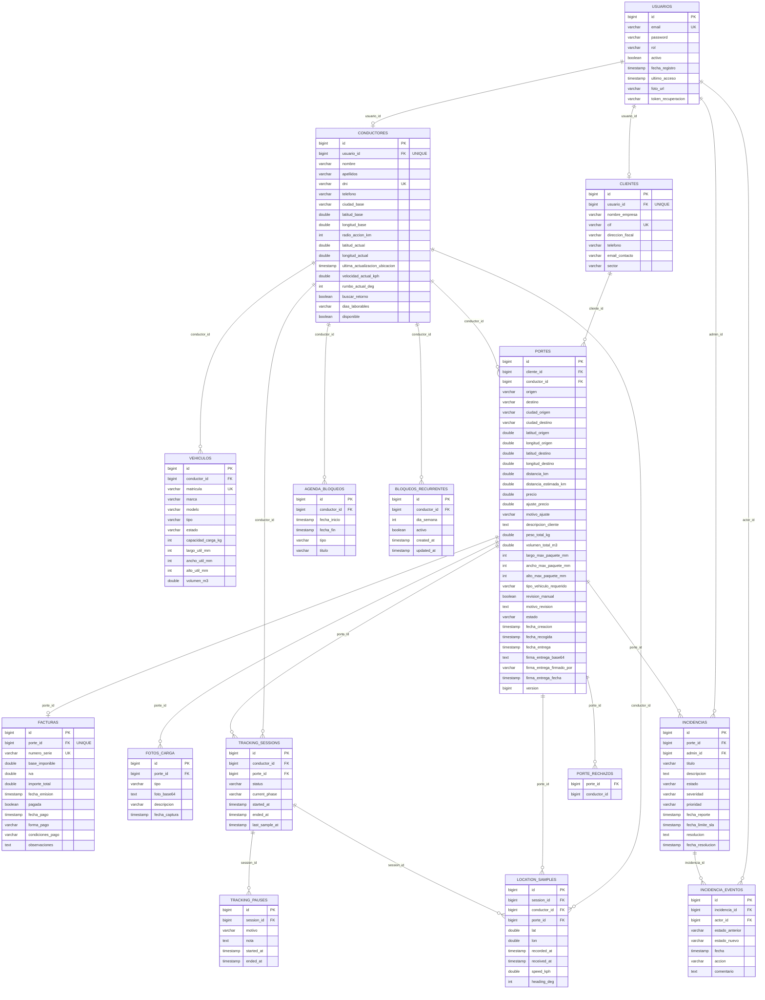
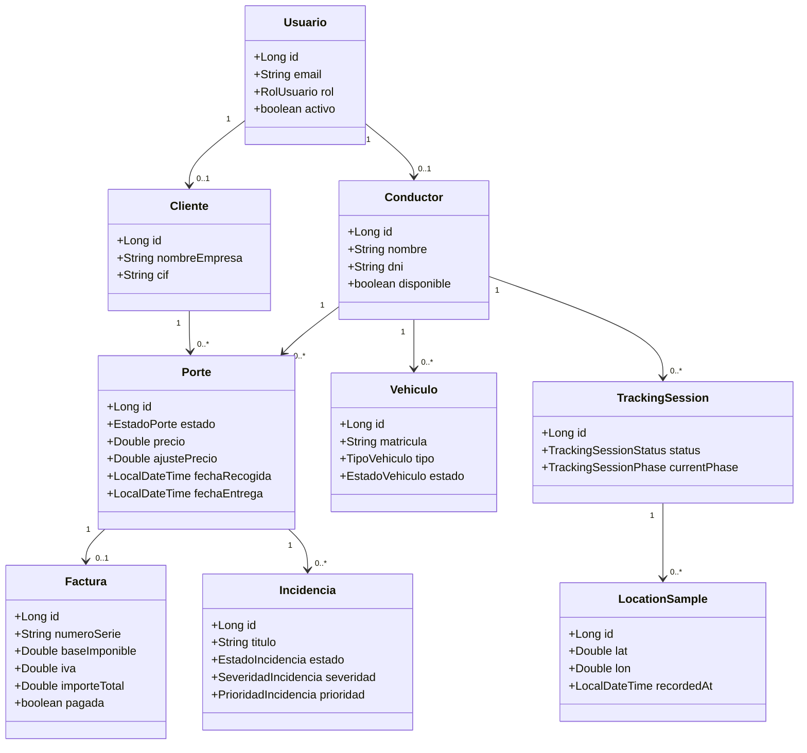
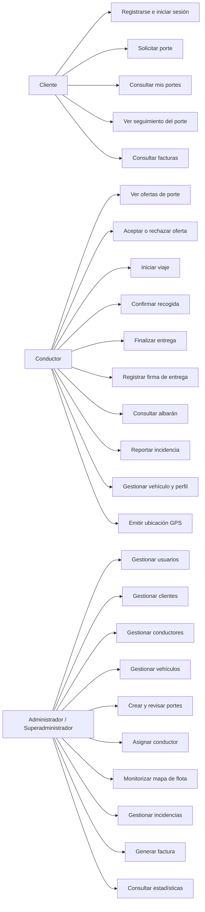
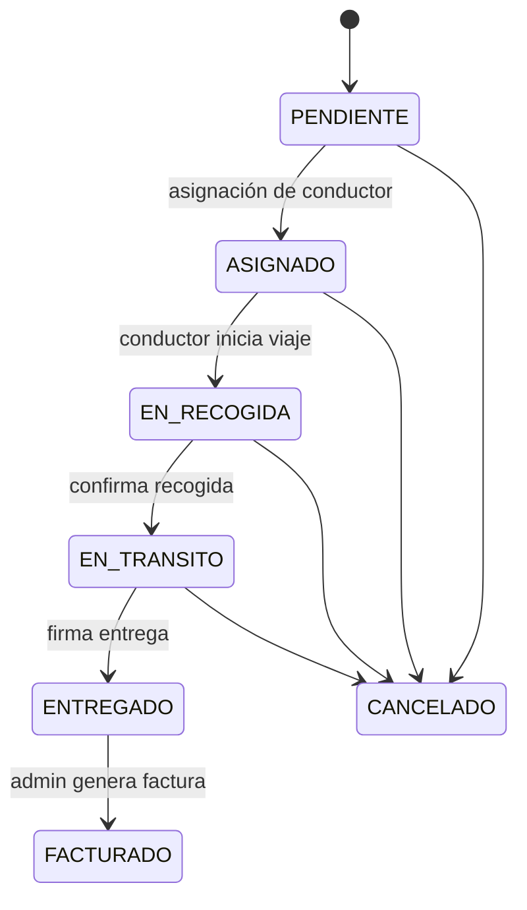
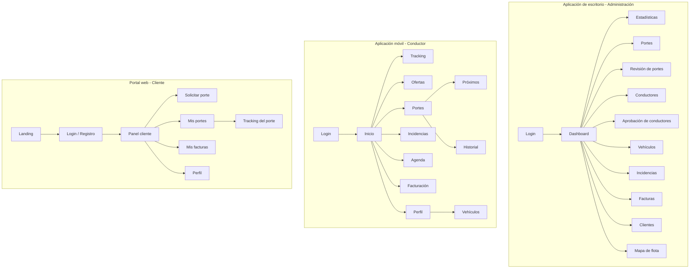

# Revisión paralela de la memoria TFG — CargoHub

> Documento de trabajo paralelo.  
> No sustituye directamente al documento original: sirve para revisar, corregir y copiar después al Word/PDF definitivo.

## Objetivo de esta revisión

Actualizar la documentación del TFG para que refleje el estado real del proyecto CargoHub tras la evolución de la aplicación desde la primera versión documentada en diciembre.

La memoria original está bien encaminada como base, pero varias partes ya no representan fielmente el sistema actual. El objetivo no es “maquillar” el texto, sino alinear la explicación académica con lo que realmente existe en el proyecto: backend, escritorio, móvil y portal web.

---

# 0. Diagnóstico inicial

## Cambios importantes respecto a la documentación original

### 1. El sistema ya no se compone solo de dos aplicaciones

En la documentación original se describe CargoHub como un sistema formado principalmente por:

- una aplicación de escritorio para administración;
- una aplicación móvil para conductores.

Actualmente el sistema real es un ecosistema más completo:

- API REST central desarrollada con Spring Boot;
- aplicación de escritorio para administración y operaciones;
- aplicación móvil Android para conductores;
- portal web para clientes;
- base de datos PostgreSQL;
- generación documental de albaranes y facturas.

### 2. El cliente sí tiene presencia en el sistema

La documentación original indica que el cliente no accede directamente a la plataforma. Esto ha cambiado. Ahora existe un portal web desde el que el cliente puede interactuar con parte del flujo: solicitud, consulta y seguimiento de portes.

Por tanto, el cliente debe aparecer como actor real del sistema, no solo como entidad externa.

### 3. El flujo de estados del porte cambió

El sistema actual trabaja con un flujo de estados más preciso:

| Estado | Significado |
|-------|-------------|
| `PENDIENTE` | Porte creado o pendiente de revisión/asignación. |
| `ASIGNADO` | Porte asignado a un conductor, pero el viaje aún no ha comenzado. |
| `EN_RECOGIDA` | El conductor ha iniciado el desplazamiento hacia el punto de recogida. |
| `EN_TRANSITO` | La mercancía ya ha sido recogida y se dirige al destino. |
| `ENTREGADO` | La entrega ha sido firmada y confirmada. |
| `FACTURADO` | El porte ya tiene factura generada. |
| `CANCELADO` | El porte ha sido cancelado. |

El estado `EN_RECOGIDA` es especialmente importante porque evita que un porte simplemente asignado active el tracking como si ya estuviese en ruta.

### 4. Albarán y factura son documentos distintos

La documentación original plantea la factura como documento generado automáticamente al finalizar el porte. En la implementación actual se ha separado el flujo:

- al finalizar la entrega se registra la firma y se genera un albarán como comprobante logístico;
- la factura la genera posteriormente el administrador desde la aplicación de escritorio.

Esta separación es más correcta desde el punto de vista funcional: primero se acredita la entrega y después se revisa y emite el documento económico.

### 5. Algunas funcionalidades deben pasar a “mejoras futuras”

Hay funcionalidades descritas en la memoria original que no forman parte del alcance real actual o han sido eliminadas:

- sistema de valoraciones;
- chat interno completo;
- nóminas completas;
- pagos automáticos;
- optimización avanzada mediante IA real;
- factura electrónica oficial integrada con organismos externos.

No es negativo que estas funciones no estén implementadas. En un TFG es mucho mejor delimitar bien el alcance que prometer funcionalidades que luego no aparecen en la demo.

---

# 1. Descripción general del proyecto

## 1.1. Introducción — propuesta revisada

El sector del transporte de mercancías por carretera continúa siendo una pieza esencial dentro de la economía española y europea. La globalización, el crecimiento del comercio electrónico y la necesidad de mover productos entre empresas, almacenes y clientes han incrementado la demanda de servicios logísticos ágiles, trazables y bien coordinados.

Sin embargo, esta evolución no ha afectado por igual a todos los participantes del sector. Mientras que las grandes empresas de transporte han incorporado sistemas digitales para gestionar rutas, flotas, incidencias y documentación, muchos transportistas autónomos y pequeñas cooperativas continúan trabajando con herramientas poco integradas: llamadas telefónicas, hojas de cálculo, registros manuales o aplicaciones aisladas.

Esta brecha tecnológica provoca varios problemas: dificulta la captación de nuevos servicios, reduce la visibilidad sobre el estado real de cada porte, complica la gestión documental y limita la capacidad de competir frente a operadores logísticos de mayor tamaño.

CargoHub nace como respuesta a esta situación. El proyecto plantea una plataforma digital para la gestión integral de portes, orientada a conectar clientes, administradores y conductores dentro de un mismo ecosistema. Su objetivo es centralizar la operativa logística, facilitar la asignación de trabajos, permitir el seguimiento de los portes en tiempo real y digitalizar procesos clave como la firma de entrega, el albarán y la facturación.

A diferencia de una simple aplicación de rutas, CargoHub no se limita a mostrar trayectos al conductor. El sistema actúa como una plataforma de coordinación logística: los clientes pueden solicitar portes, la administración puede revisar y asignar servicios, los conductores pueden aceptar trabajos y actualizar el estado del transporte, y el sistema mantiene la trazabilidad de todo el proceso.

El nombre “CargoHub” refleja esta idea: un centro digital de operaciones de transporte donde convergen cargas, conductores, clientes, documentación y seguimiento.

## 1.2. Características — propuesta revisada

CargoHub es una plataforma multiplataforma para la gestión de transporte de mercancías. El sistema está dividido en varias aplicaciones conectadas a una API central, lo que permite separar la lógica de negocio de las interfaces utilizadas por cada tipo de usuario.

La solución se compone de los siguientes elementos principales:

### API REST central

El backend centraliza la lógica de negocio del sistema. Gestiona la autenticación, los roles, los usuarios, los clientes, los conductores, los vehículos, los portes, las incidencias, el seguimiento GPS, los albaranes y las facturas.

### Aplicación de escritorio

La aplicación de escritorio está orientada al personal de administración y operaciones. Desde ella se pueden gestionar los principales recursos del sistema: clientes, conductores, vehículos, portes, incidencias, facturas y seguimiento de flota.

Entre sus funciones principales se encuentran:

- gestión de clientes;
- gestión de conductores;
- gestión de vehículos;
- creación, revisión y asignación de portes;
- consulta y filtrado de portes;
- monitorización de la flota en mapa;
- gestión de incidencias;
- generación de facturas;
- descarga de albaranes de entrega.

### Aplicación móvil Android

La aplicación móvil está orientada al conductor. Su objetivo es ofrecer una herramienta sencilla y clara para consultar ofertas, aceptar portes, iniciar el viaje, confirmar la recogida, realizar el seguimiento y finalizar la entrega mediante firma.

Entre sus funciones principales se encuentran:

- consulta de portes disponibles o asignados;
- aceptación o rechazo de ofertas;
- inicio del viaje hacia el punto de recogida;
- confirmación de recogida de la mercancía;
- seguimiento durante el trayecto;
- finalización del porte;
- firma de entrega;
- consulta de historial;
- gestión del perfil y vehículo asociado;
- reporte de incidencias.

### Portal web de cliente

El portal web permite que los clientes participen en el flujo del sistema. Desde esta interfaz pueden solicitar portes, consultar información relacionada con sus servicios y acceder al seguimiento del transporte cuando corresponda.

Esto convierte al cliente en un actor real dentro del sistema y mejora la transparencia del proceso logístico.

### Base de datos

La persistencia del sistema se realiza mediante una base de datos relacional PostgreSQL. En ella se almacenan usuarios, roles, clientes, conductores, vehículos, portes, incidencias, ubicaciones, albaranes y facturas.

### Documentación logística y económica

CargoHub diferencia entre dos documentos clave:

- **Albarán de entrega:** documento logístico que acredita que la mercancía ha sido entregada y firmada.
- **Factura:** documento económico generado posteriormente por administración una vez revisados los datos del servicio.

Esta separación permite que la entrega quede confirmada antes de emitir la factura, reduciendo errores y facilitando el control administrativo.

## 1.3. Alcance del proyecto — propuesta revisada

El alcance del proyecto se centra en el desarrollo de un sistema funcional que cubra el ciclo principal de gestión de un porte: solicitud, revisión, asignación, aceptación por parte del conductor, seguimiento, entrega, generación de albarán y facturación.

El sistema contempla cuatro perfiles principales:

- administrador;
- conductor;
- cliente;
- superadministrador o responsable técnico.

### Funcionalidades incluidas en el alcance

El proyecto incluye las siguientes funcionalidades:

- autenticación de usuarios mediante credenciales;
- control de acceso por roles;
- gestión de clientes;
- gestión de conductores;
- gestión de vehículos;
- creación y revisión de portes;
- asignación de portes a conductores;
- aceptación y rechazo de ofertas desde la app móvil;
- cambio de estado de los portes;
- seguimiento GPS durante portes activos;
- monitorización de flota desde la aplicación de escritorio;
- registro y gestión de incidencias;
- firma de entrega desde la app móvil;
- generación de albarán de entrega;
- generación manual de facturas desde administración;
- consulta y filtrado de información en las distintas interfaces.

### Funcionalidades fuera del alcance actual

Para mantener un alcance realista y coherente con el tiempo disponible, algunas funcionalidades se consideran mejoras futuras:

- sistema de chat interno completo;
- sistema de valoraciones entre clientes y conductores;
- cálculo completo de nóminas o liquidaciones avanzadas;
- integración con pasarelas de pago;
- integración oficial con factura electrónica;
- optimización avanzada de rutas mediante inteligencia artificial;
- despliegue productivo completo en infraestructura cloud definitiva.

Estas funcionalidades podrían incorporarse en futuras versiones, pero no forman parte del núcleo funcional desarrollado para esta entrega.

## 1.4. Justificación y análisis de la realidad — propuesta revisada

CargoHub surge como respuesta a una necesidad real del sector logístico: la digitalización accesible para transportistas autónomos, pequeñas cooperativas y empresas que necesitan gestionar portes de forma más eficiente.

El transporte por carretera sigue siendo uno de los medios principales para el movimiento de mercancías en España. No obstante, gran parte del tejido profesional del sector está formado por autónomos y pequeñas empresas que no siempre disponen de herramientas avanzadas para competir en igualdad de condiciones con grandes operadores.

La falta de digitalización puede provocar problemas como:

- dificultad para organizar los servicios;
- escasa trazabilidad de los portes;
- dependencia de llamadas telefónicas o registros manuales;
- falta de información en tiempo real;
- gestión documental poco eficiente;
- dificultad para demostrar entregas o incidencias.

CargoHub propone una solución centralizada que permite reducir esa brecha. El sistema ofrece una herramienta de trabajo para conductores, un panel de control para administración y un portal para clientes. De este modo, todos los actores principales del proceso logístico comparten información a través de una misma plataforma.

Además, el proyecto incorpora elementos importantes para una operativa profesional: control de estados, seguimiento GPS, firma de entrega, albarán, facturación y gestión de incidencias. Estas características permiten mejorar la transparencia, reducir errores administrativos y facilitar la toma de decisiones.

Desde el punto de vista académico, el proyecto también resulta adecuado para un ciclo de Desarrollo de Aplicaciones Multiplataforma, ya que integra distintas tecnologías y entornos: backend, base de datos, aplicación de escritorio, aplicación móvil y portal web.

---

# 2. Estudio de la viabilidad del sistema

> Pendiente de revisión completa.

Notas para adaptar esta sección:

- Mantener DAFO, PESTEL y Porter, pero revisar redacción y coherencia.
- Eliminar menciones a funcionalidades que ya no existen, como valoraciones si aparecen como parte central.
- Ajustar el modelo económico para que no prometa nóminas o pagos automáticos si no están implementados.
- Revisar el porcentaje de comisión: en algunas partes aparece 10% y en otras 15%.
- Mantener el enfoque SaaS, pero explicar que el TFG implementa un prototipo funcional, no una empresa real en producción.

---

# 3. Descripción del entorno tecnológico

## 3.0. Correcciones necesarias

La sección tecnológica debe actualizarse porque actualmente indica que la base de datos será MySQL. En el proyecto real se utiliza PostgreSQL.

También debe añadirse el portal web cliente, ya que no aparece correctamente representado en la documentación original.

## 3.1. Arquitectura tecnológica — propuesta revisada

CargoHub se ha desarrollado siguiendo una arquitectura cliente-servidor desacoplada. La lógica de negocio se concentra en una API REST central, mientras que las distintas interfaces de usuario consumen sus servicios mediante peticiones HTTP.

Esta arquitectura permite que varias aplicaciones trabajen sobre la misma información sin duplicar lógica ni acceder directamente a la base de datos.

El sistema se divide en las siguientes capas:

| Capa | Tecnología | Función |
|---|---|---|
| Backend | Java + Spring Boot | API REST, lógica de negocio, seguridad y acceso a datos. |
| Base de datos | PostgreSQL | Persistencia relacional de la información. |
| Escritorio | Vue.js + Electron | Aplicación de administración y operaciones. |
| Móvil | Android nativo con Java | Aplicación del conductor. |
| Web cliente | Vue.js | Portal para clientes. |
| Seguridad | JWT + cifrado de contraseñas | Autenticación y autorización por roles. |

## 3.2. Backend

El backend está desarrollado con Java y Spring Boot. Expone una API REST que centraliza las operaciones del sistema y permite que las distintas aplicaciones consuman los mismos datos.

Sus responsabilidades principales son:

- autenticación y autorización;
- gestión de usuarios y roles;
- gestión de clientes;
- gestión de conductores;
- gestión de vehículos;
- gestión de portes;
- control de estados;
- gestión de incidencias;
- registro de ubicaciones GPS;
- generación de albaranes;
- generación de facturas;
- validación de reglas de negocio.

## 3.3. Base de datos

La base de datos utilizada es PostgreSQL. Se ha escogido una base de datos relacional porque las entidades del sistema presentan relaciones claras: usuarios, conductores, vehículos, clientes, portes, incidencias, ubicaciones y facturas.

El uso de PostgreSQL permite mantener integridad referencial, consultas estructuradas y consistencia en operaciones críticas como cambios de estado, asignaciones y generación documental.

## 3.4. Aplicación de escritorio

La aplicación de escritorio está desarrollada con Vue.js y Electron. Está destinada al personal de administración de CargoHub y permite gestionar la operativa diaria del sistema.

Desde esta aplicación se pueden consultar, crear, modificar y filtrar los principales datos del sistema. También permite monitorizar la flota en un mapa y gestionar facturas y albaranes.

## 3.5. Aplicación móvil

La aplicación móvil está desarrollada de forma nativa para Android utilizando Java. Está orientada a los conductores y prioriza la claridad visual, la sencillez y el uso en contexto de movilidad.

Permite consultar portes, aceptar ofertas, iniciar el viaje, confirmar la recogida, seguir la ruta, reportar incidencias y firmar la entrega.

## 3.6. Portal web cliente

El portal web permite a los clientes acceder a funcionalidades relacionadas con sus portes. Su inclusión mejora la transparencia del servicio y permite que el cliente tenga una vía digital de consulta sin depender exclusivamente de llamadas o correos electrónicos.

---

# 4. Especificación de requisitos

## 4.1. Requisitos funcionales — propuesta revisada

> Esta tabla sustituye la estructura anterior. Se recomienda revisar uno por uno antes de pasarlo al Word.

| Código | Requisito funcional | Descripción |
|---|---|---|
| RF1 | Autenticación de usuarios | El sistema debe permitir iniciar sesión mediante email y contraseña, generando un token de autenticación para acceder a las funcionalidades correspondientes. |
| RF2 | Gestión de roles y permisos | El sistema debe restringir las acciones disponibles según el rol del usuario: administrador, conductor, cliente o superadministrador. |
| RF3 | Gestión de usuarios | El sistema debe permitir crear, consultar, modificar y dar de baja usuarios según los permisos del rol autenticado. |
| RF4 | Gestión de clientes | El sistema debe permitir registrar clientes, modificar sus datos y consultar los portes asociados a cada uno. |
| RF5 | Gestión de conductores | El sistema debe permitir registrar conductores, consultar su información, actualizar su estado y asociarlos a usuarios del sistema. |
| RF6 | Gestión de vehículos | El sistema debe permitir registrar vehículos, modificar sus datos, cambiar su estado y asociarlos a conductores. |
| RF7 | Solicitud y creación de portes | El sistema debe permitir crear portes con origen, destino, cliente, fechas, descripción de carga, precio y datos necesarios para la operación. |
| RF8 | Revisión y asignación de portes | El sistema debe permitir que administración revise un porte y lo asigne a un conductor adecuado. |
| RF9 | Gestión de ofertas al conductor | El conductor debe poder aceptar o rechazar ofertas de portes desde la aplicación móvil. |
| RF10 | Control de estados del porte | El sistema debe gestionar el ciclo de vida del porte mediante estados: `PENDIENTE`, `ASIGNADO`, `EN_RECOGIDA`, `EN_TRANSITO`, `ENTREGADO`, `FACTURADO` y `CANCELADO`. |
| RF11 | Inicio de viaje | El conductor debe poder iniciar un viaje asignado, pasando el porte de `ASIGNADO` a `EN_RECOGIDA`. |
| RF12 | Confirmación de recogida | El conductor debe poder confirmar la recogida de la mercancía, pasando el porte de `EN_RECOGIDA` a `EN_TRANSITO`. |
| RF13 | Finalización de entrega | El conductor debe poder finalizar el porte cuando llegue al destino, iniciando el proceso de firma de entrega. |
| RF14 | Firma de entrega | El sistema debe permitir registrar la firma de entrega como prueba de recepción de la mercancía. |
| RF15 | Generación de albarán | El sistema debe generar un albarán de entrega asociado al porte entregado. |
| RF16 | Generación de facturas | El administrador debe poder generar facturas de portes entregados, revisando previamente los datos del servicio. |
| RF17 | Seguimiento GPS | El sistema debe registrar y mostrar la ubicación del conductor durante los estados activos del porte. |
| RF18 | Mapa de flota | La aplicación de escritorio debe permitir visualizar conductores que estén reportando ubicación y consultar información del porte activo. |
| RF19 | Gestión de incidencias | El conductor debe poder reportar incidencias asociadas a un porte y la administración debe poder consultarlas y gestionarlas. |
| RF20 | Portal cliente | El cliente debe poder acceder al portal web para consultar información relacionada con sus portes y seguimiento. |
| RF21 | Consulta y filtrado de información | Las aplicaciones deben permitir buscar y filtrar información relevante como portes, clientes, vehículos, conductores, facturas o incidencias. |

## 4.2. Requisitos no funcionales — propuesta revisada

| Código | Requisito no funcional | Descripción |
|---|---|---|
| RNF1 | Seguridad | El sistema debe proteger el acceso mediante autenticación, roles y contraseñas cifradas. |
| RNF2 | Protección de datos | Los datos personales y operativos deben gestionarse de forma segura, limitando el acceso según el rol del usuario. |
| RNF3 | Usabilidad móvil | La aplicación Android debe ser clara, sencilla y usable por conductores en un contexto de movilidad. |
| RNF4 | Usabilidad de escritorio | La aplicación de escritorio debe facilitar la gestión de grandes volúmenes de información mediante tablas, filtros y acciones claras. |
| RNF5 | Rendimiento | La API debe responder de forma ágil a operaciones habituales de consulta y gestión. |
| RNF6 | Trazabilidad | El sistema debe conservar información suficiente para reconstruir el ciclo de vida de un porte: asignación, estados, incidencias, entrega y facturación. |
| RNF7 | Integridad documental | Los albaranes y facturas deben generarse a partir de datos consistentes del sistema. |
| RNF8 | Disponibilidad | El sistema debe estar preparado para funcionar de forma estable durante la operativa diaria. |
| RNF9 | Mantenibilidad | El proyecto debe mantener una separación clara entre backend, base de datos e interfaces de usuario. |
| RNF10 | Escalabilidad | La arquitectura debe permitir añadir nuevas funcionalidades o interfaces sin rehacer el sistema completo. |
| RNF11 | Compatibilidad móvil | La aplicación móvil debe ejecutarse en dispositivos Android compatibles con la versión objetivo del proyecto. |
| RNF12 | Compatibilidad escritorio | La aplicación de escritorio debe poder ejecutarse en entornos Windows modernos. |
| RNF13 | Compatibilidad web | El portal cliente debe funcionar en navegadores actuales. |

## 4.3. Funcionalidades futuras

Las siguientes funcionalidades se consideran posibles ampliaciones futuras:

- chat interno entre conductores y administración;
- sistema de valoraciones;
- liquidaciones avanzadas para conductores;
- integración con pasarela de pagos;
- integración oficial con sistemas de factura electrónica;
- optimización automática avanzada de rutas;
- notificaciones push completas;
- despliegue productivo definitivo en la nube.

---

# Pendientes de revisión posteriores

- Revisar si los diagramas Mermaid se pasan a imagen para Word o se rehacen con draw.io.
- Redactar sección de pruebas.
- Redactar manual de usuario.
- Redactar manual de instalación y despliegue.
- Redactar conclusiones.
- Revisar bibliografía y referencias.

---

# 5. Diagramas actualizados

> Propuesta de diagramas adaptada a la implementación real del proyecto.  
> Recomendación: usar estos diagramas como base conceptual y exportarlos posteriormente como imagen para insertarlos en Word.

## 5.1. Criterio de actualización

Los diagramas originales deben actualizarse porque el sistema ha evolucionado desde la primera versión documentada. Actualmente CargoHub no se limita a una aplicación móvil y una aplicación de escritorio, sino que incorpora también un portal web para clientes, un backend centralizado, seguimiento GPS, albaranes, facturas e incidencias.

Para que la memoria sea coherente con la aplicación real, se propone dividir la explicación en varios diagramas:

- modelo entidad-relación general;
- modelo relacional;
- diagrama de clases simplificado;
- diagrama de casos de uso;
- mapa de navegación por aplicación.

En un TFG de CFGS no conviene saturar los diagramas con todos los detalles técnicos internos. Por eso, algunos elementos auxiliares se representan de forma simplificada.

## 5.2. Modelo entidad-relación actualizado

Este modelo representa el sistema desde un punto de vista conceptual. Se muestran las entidades principales, sus atributos más importantes y la cardinalidad entre ellas. La entidad central es **Porte**, porque concentra la solicitud logística, la asignación del conductor, el seguimiento, la entrega, las incidencias y la facturación.

Para respetar la notación clásica de entidad-relación, se representa mediante:

- **rectángulos**, para las entidades;
- **rombos**, para las relaciones;
- **óvalos**, para los atributos principales;
- etiquetas `1`, `0..1` y `N`, para indicar la cardinalidad.

El diagrama anterior es el modelo entidad-relación en sentido académico: entidades, relaciones y cardinalidades. A continuación se incluye una versión complementaria con más atributos por entidad para que el modelo también pueda defenderse desde el punto de vista de la implementación real.

### Explicación del modelo

El modelo parte de **Usuario** como entidad de autenticación. A partir de ella se especializan dos perfiles principales: **Cliente**, que solicita portes desde el portal web, y **Conductor**, que ejecuta los servicios desde la aplicación móvil. Esta separación evita duplicar credenciales y permite asociar permisos mediante el rol del usuario.

La entidad **Porte** es el eje del sistema. Cada porte pertenece a un cliente y puede tener un conductor asignado. Además almacena el origen, el destino, las coordenadas, las dimensiones de la carga, el estado operativo, las fechas principales, la información de revisión manual y la firma de entrega.

El **albarán** se representa como documento derivado del porte entregado, no como una tabla independiente. Se genera a partir de los datos del porte, la entrega y la firma. La **factura**, en cambio, sí se persiste como entidad propia y se relaciona uno a uno con el porte.

Las incidencias se separan en dos niveles: **Incidencia**, que contiene el problema principal, y **IncidenciaEvento**, que registra el historial de cambios. El seguimiento GPS también se separa en sesiones, pausas y muestras de ubicación para no sobrecargar la tabla de portes.

## 5.3. Modelo relacional actualizado

El modelo relacional muestra una visión más cercana a la base de datos. Se representan las tablas principales, claves primarias, claves foráneas, restricciones únicas y atributos relevantes. Esta versión está pensada para lectura en memoria escrita; la versión extendida se incluye después para impresión en DIN A3.

### Nota sobre el modelo relacional

Algunas tablas pueden considerarse auxiliares, como `tracking_pauses`, `location_samples`, `incidencia_eventos`, `agenda_bloqueos` o `porte_rechazos`. No obstante, se incluyen en la versión extendida porque ayudan a demostrar que el sistema no solo almacena portes, sino también trazabilidad operativa, disponibilidad de conductores e historial de decisiones.

El albarán no aparece como tabla relacional independiente porque en la implementación actual se genera como documento PDF a partir del porte entregado, la firma y los datos asociados al servicio.

Si el diagrama queda demasiado grande para Word, se recomienda dividirlo en dos:

- modelo relacional principal: usuarios, clientes, conductores, vehículos, portes, facturas e incidencias;
- modelo relacional operativo: agenda, tracking, rechazos de ofertas y muestras de ubicación.

## 5.3.1. Modelo relacional extendido para impresión en DIN A3

> Esta versión está pensada para exportarse como imagen grande e insertarse en una hoja DIN A3 horizontal.  
> Incluye más campos y relaciones que la versión resumida, manteniendo una estructura defendible para explicar la base de datos real.

### Observaciones para defender el modelo relacional

- `USUARIOS` centraliza la autenticación y el rol de acceso.
- `CLIENTES` y `CONDUCTORES` amplían los datos de usuario según el perfil.
- `PORTES` es la tabla central de la operativa logística y mantiene tanto datos comerciales como datos de ejecución.
- `FACTURAS` se relaciona uno a uno con `PORTES`, porque una factura corresponde a un servicio concreto.
- El albarán no se modela como tabla porque se genera como documento derivado del porte entregado.
- `INCIDENCIAS` y `INCIDENCIA_EVENTOS` permiten registrar problemas y su evolución.
- `TRACKING_SESSIONS`, `TRACKING_PAUSES` y `LOCATION_SAMPLES` separan el seguimiento GPS del resto del sistema para no sobrecargar la tabla `PORTES`.
- `AGENDA_BLOQUEOS` y `BLOQUEOS_RECURRENTES` explican la disponibilidad del conductor.
- `PORTE_RECHAZOS` es una tabla auxiliar para recordar qué conductores rechazaron una oferta.

## 5.4. Diagrama de clases simplificado

Este diagrama representa las clases principales desde un punto de vista académico. No se incluyen todos los atributos reales para mantener la claridad del documento.

## 5.4.1. Diagrama de clases extendido para impresión en DIN A3

> Esta versión es más completa y está pensada para impresión amplia.  
> Representa entidades, enumeraciones principales y operaciones relevantes desde un punto de vista académico.

```mermaid
classDiagram
direction LR

class Usuario {
  +Long id
  +String email
  +String password
  +RolUsuario rol
  +boolean activo
  +LocalDateTime fechaRegistro
  +LocalDateTime ultimoAcceso
  +String fotoUrl
  +autenticar()
  +cambiarPassword()
  +activar()
  +desactivar()
}

class Cliente {
  +Long id
  +String nombreEmpresa
  +String cif
  +String direccionFiscal
  +String telefono
  +String emailContacto
  +String sector
  +solicitarPorte()
  +consultarPortes()
  +consultarFacturas()
}

class Conductor {
  +Long id
  +String nombre
  +String apellidos
  +String dni
  +String telefono
  +String ciudadBase
  +Double latitudBase
  +Double longitudBase
  +Double radioAccionKm
  +Double latitudActual
  +Double longitudActual
  +boolean disponible
  +aceptarOferta()
  +rechazarOferta()
  +iniciarViaje()
  +confirmarRecogida()
  +finalizarPorte()
  +reportarUbicacion()
}

class Vehiculo {
  +Long id
  +String matricula
  +String marca
  +String modelo
  +TipoVehiculo tipo
  +EstadoVehiculo estado
  +Double capacidadCargaKg
  +Integer largoUtilMm
  +Integer anchoUtilMm
  +Integer altoUtilMm
  +Double volumenM3
  +cambiarEstado()
  +asignarConductor()
  +desvincularConductor()
}

class Porte {
  +Long id
  +String origen
  +String destino
  +String ciudadOrigen
  +String ciudadDestino
  +Double latitudOrigen
  +Double longitudOrigen
  +Double latitudDestino
  +Double longitudDestino
  +Double distanciaKm
  +Double precio
  +Double ajustePrecio
  +String motivoAjuste
  +EstadoPorte estado
  +LocalDateTime fechaCreacion
  +LocalDateTime fechaRecogida
  +LocalDateTime fechaEntrega
  +String firmaEntregaBase64
  +String firmaEntregaFirmadoPor
  +LocalDateTime firmaEntregaFecha
  +asignarConductor()
  +cambiarEstado()
  +registrarFirmaEntrega()
  +generarAlbaran()
}

class Factura {
  +Long id
  +String numeroSerie
  +Double baseImponible
  +Double iva
  +Double importeTotal
  +LocalDateTime fechaEmision
  +boolean pagada
  +LocalDateTime fechaPago
  +String formaPago
  +String condicionesPago
  +calcularImportes()
  +marcarPagada()
  +generarPdf()
}

class FotoCarga {
  +Long id
  +String tipo
  +String fotoBase64
  +String descripcion
  +LocalDateTime fechaCaptura
  +adjuntarFoto()
}

class Incidencia {
  +Long id
  +String titulo
  +String descripcion
  +EstadoIncidencia estado
  +SeveridadIncidencia severidad
  +PrioridadIncidencia prioridad
  +LocalDateTime fechaReporte
  +LocalDateTime fechaLimiteSla
  +String resolucion
  +LocalDateTime fechaResolucion
  +abrir()
  +cambiarEstado()
  +resolver()
}

class IncidenciaEvento {
  +Long id
  +EstadoIncidencia estadoAnterior
  +EstadoIncidencia estadoNuevo
  +LocalDateTime fecha
  +String accion
  +String comentario
  +registrarEvento()
}

class AgendaBloqueo {
  +Long id
  +LocalDateTime fechaInicio
  +LocalDateTime fechaFin
  +String tipo
  +String titulo
  +crearBloqueo()
  +cancelarBloqueo()
}

class BloqueoRecurrente {
  +Long id
  +Integer diaSemana
  +boolean activo
  +LocalDateTime createdAt
  +LocalDateTime updatedAt
  +activar()
  +desactivar()
}

class TrackingSession {
  +Long id
  +TrackingSessionStatus status
  +TrackingSessionPhase currentPhase
  +LocalDateTime startedAt
  +LocalDateTime endedAt
  +LocalDateTime lastSampleAt
  +iniciar()
  +pausar()
  +reanudar()
  +finalizar()
}

class TrackingPause {
  +Long id
  +String motivo
  +String nota
  +LocalDateTime startedAt
  +LocalDateTime endedAt
  +cerrarPausa()
}

class LocationSample {
  +Long id
  +Double lat
  +Double lon
  +LocalDateTime recordedAt
  +LocalDateTime receivedAt
  +Double speedKph
  +Integer headingDeg
  +registrarMuestra()
}

class RolUsuario {
  <<enumeration>>
  SUPERADMIN
  ADMIN
  CONDUCTOR
  CLIENTE
}

class EstadoPorte {
  <<enumeration>>
  PENDIENTE
  ASIGNADO
  EN_RECOGIDA
  EN_TRANSITO
  ENTREGADO
  FACTURADO
  CANCELADO
}

class TipoVehiculo {
  <<enumeration>>
  FURGONETA
  RIGIDO
  TRAILER
  ESPECIAL
}

class EstadoVehiculo {
  <<enumeration>>
  DISPONIBLE
  EN_MANTENIMIENTO
  BAJA
}

class EstadoIncidencia {
  <<enumeration>>
  ABIERTA
  EN_REVISION
  RESUELTA
  DESESTIMADA
}

class SeveridadIncidencia {
  <<enumeration>>
  BAJA
  MEDIA
  ALTA
  CRITICA
}

class PrioridadIncidencia {
  <<enumeration>>
  BAJA
  MEDIA
  ALTA
  URGENTE
}

class TrackingSessionStatus {
  <<enumeration>>
  ACTIVE
  PAUSED
  FINISHED
}

class TrackingSessionPhase {
  <<enumeration>>
  PICKUP
  DELIVERY
}

Usuario "1" --> "0..1" Cliente : perfil
Usuario "1" --> "0..1" Conductor : perfil
Usuario --> RolUsuario

Cliente "1" --> "0..*" Porte : solicita
Conductor "1" --> "0..*" Porte : realiza
Conductor "1" --> "0..*" Vehiculo : posee
Conductor "1" --> "0..*" AgendaBloqueo : agenda
Conductor "1" --> "0..*" BloqueoRecurrente : disponibilidad
Conductor "1" --> "0..*" TrackingSession : seguimiento
Conductor "1" --> "0..*" LocationSample : telemetria

Porte "1" --> "0..1" Factura : factura
Porte "1" --> "0..*" FotoCarga : fotos
Porte "1" --> "0..*" Incidencia : incidencias
Porte "1" --> "0..*" TrackingSession : sesiones
Porte "1" --> "0..*" LocationSample : ubicaciones
Porte --> EstadoPorte

Vehiculo --> TipoVehiculo
Vehiculo --> EstadoVehiculo

Incidencia "1" --> "0..*" IncidenciaEvento : historial
Incidencia --> EstadoIncidencia
Incidencia --> SeveridadIncidencia
Incidencia --> PrioridadIncidencia

TrackingSession "1" --> "0..*" TrackingPause : pausas
TrackingSession "1" --> "0..*" LocationSample : muestras
TrackingSession --> TrackingSessionStatus
TrackingSession --> TrackingSessionPhase

```

### Recomendación para la versión DIN A3

Para entregar el diagrama de clases en DIN A3, se recomienda usar esta versión extendida. Si al exportarlo queda demasiado denso, se puede dividir en dos láminas:

1. **Modelo de dominio principal:** Usuario, Cliente, Conductor, Vehículo, Porte, Factura e Incidencia.
2. **Modelo operativo:** TrackingSession, TrackingPause, LocationSample, AgendaBloqueo, BloqueoRecurrente y Notificación.

La ventaja de mantenerlo en una sola lámina DIN A3 es que se ve la relación completa del sistema. La desventaja es que, si se imprime en tamaño menor, puede perder legibilidad.

## 5.5. Diagrama de casos de uso actualizado

El sistema contempla tres actores principales: cliente, conductor y administrador. El superadministrador se puede considerar una especialización del administrador con permisos completos.

### Flujo principal de estados del porte

## 5.6. Mapa de navegación actualizado

El mapa de navegación se divide en las tres interfaces principales: aplicación de escritorio, aplicación móvil y portal web.

## 5.7. Recomendación para insertar los diagramas en Word

Los diagramas anteriores están escritos en Mermaid porque es un formato claro, versionable y fácil de mantener. Para incluirlos en Word se recomienda:

1. copiar cada bloque Mermaid en un editor compatible, como Mermaid Live Editor;
2. exportar el diagrama como PNG o SVG;
3. insertar la imagen en Word;
4. añadir debajo una breve explicación textual.

Para la entrega final se recomienda usar imágenes en Word, no pegar el código Mermaid directamente.

## 5.8. Decisiones de simplificación

Para mantener la memoria clara y defendible, se toman las siguientes decisiones:

- El superadministrador se trata como una variante del administrador con permisos ampliados.
- Las tablas auxiliares de tracking pueden aparecer en un diagrama separado si el modelo completo queda demasiado grande.
- El sistema de chat no se incluye como caso de uso principal porque no forma parte del alcance actual consolidado.
- Las valoraciones no se incluyen porque fueron eliminadas del alcance funcional.
